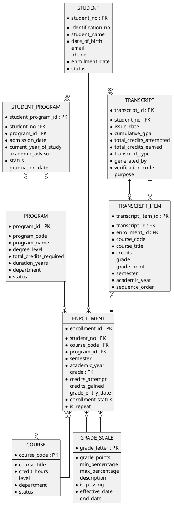

# University Student Transcript Database System

## 1. ORGANIZATION INFORMATION

### About the Institution

**University Name:** Metropolitan University of Hong Kong (MUHK)

**Background:** Metropolitan University of Hong Kong is a publicly funded tertiary institution established in 1991. The university serves approximately 18,000 students across 6 faculties. The university offers 85 undergraduate programs, 120 postgraduate programs, and various professional diplomas and certificates.

**Organizational Structure:**
- **Academic Registry**: Responsible for student records, enrollment, and transcript generation
- **Information Technology Services**: Manages the university's database systems
- **Faculty Offices**: Handle program-specific academic matters
- **Examinations Office**: Manages grade processing and academic standing

**Current Challenge:** The university currently manages student transcripts using a combination of spreadsheets and an outdated legacy system from 2005. Staff spend approximately 15 hours per week manually verifying data, correcting errors, and generating official transcripts. Students frequently report delays in receiving their academic records.

---

## 2. BUSINESS NEEDS

### Primary Objectives

The university requires a comprehensive database system to manage student academic records and generate accurate transcripts. The system must:

1. **Record student personal information** including Student Name, Student Number, Identification Number (HKID/Passport), and Date of Birth

2. **Record academic program information** including Theme of Study (Program Name) and Year of Study for each student

3. **Record course enrollment and completion** including:
   - Course Code and Course Title for each course taken
   - Academic Year when the course was taken
   - Credits Attempted and Credits Gained for each course
   - Grade achieved and corresponding Grade Point

4. **Generate official transcripts** that include all the above information with a clear Issue Date

5. **Calculate GPA** accurately based on credits and grade points

6. **Track academic progress** across multiple years and programs

7. **List students** who have not yet completed any courses

8. **Determine eligibility** for progression to next year of study based on completed credits

9. **Provide status summary** including total credits attempted, total credits gained, and cumulative GPA for each student

---

## 3. ASSUMPTIONS AND LIMITATIONS

### Business Process Assumptions

1. **Timely Grade Entry**: All grades will be entered within 30 days after the end of each semester. This ensures that the status summary reflects the current academic standing of students at any time.

2. **Student Record Retention**: If a student withdraws from the university or graduates, their records remain in the STUDENT table but their status is updated to "Withdrawn" or "Graduated". Records are NOT deleted because alumni require transcripts for job applications and further studies.

3. **Grading Scale Consistency**: The university uses a consistent grading scale across all faculties. If the grading scale changes, old grades remain calculated according to the scale in effect at that time.

4. **Program Changes**: Students may change their program of study. When this happens, a new STUDENT_PROGRAM record is created for the new program and the old record status is updated.

5. **Course Repeat Policy**: When a student repeats a course, both the original and repeat enrollments are retained.

6. **Academic Year Definition**: The academic year runs from September 1 to August 31. Academic Year is stored in format "YYYY-YY".

7. **Transcript Generation**: Official transcripts can only be generated by authorized Academic Registry staff.

### System Design Assumptions to Avoid Data Anomalies

1. **Student Number Reuse Prevention**: Student numbers, once assigned, will NEVER be reused, even after a student graduates or withdraws. This prevents the confusion that would occur if a new student received a former student's number.

2. **Identification Number Uniqueness Across Time**: The Identification Number must be unique across ALL students, past and present, in the system. This ensures that if a former student re-enrolls, they can be matched to their existing record.

3. **Program Code Stability**: Program codes will not be reused for different programs. If a program is discontinued, its code is retired permanently.

4. **Course Code Permanence**: Once a course code is assigned, it remains with that course permanently even if the course is no longer offered.

5. **Grade Scale Historical Tracking**: When grading policies change, the old grade scale is preserved with effective dates rather than being deleted.

6. **Transcript Snapshot Preservation**: Once a transcript is generated as "Official", the grades and course information at that moment are preserved in the TRANSCRIPT_ITEM table. Future grade changes do NOT affect previously issued official transcripts.

7. **Semester Value Standardization**: Semester values are limited to "Fall", "Spring", and "Summer" only. This prevents data inconsistency.

8. **Credit Hour Consistency**: The credit hours for a course are stored in the COURSE table and copied to ENROLLMENT at enrollment time. This prevents retroactive changes to completed enrollments.

9. **Null Grade Handling**: A NULL grade indicates that the course is in progress or grades are not yet entered. This is distinct from a failing grade "F".

10. **Deletion Restrictions**: The system will prevent deletion of any student, course, or program that has associated enrollment records.

11. **Audit Trail for Grade Changes**: Every grade change is logged with previous value, new value, user, timestamp, and reason.

12. **Academic Year Rollover**: At the start of each new academic year, the system automatically increments current_year_of_study for active students who have met progression requirements.

13. **Credit Gained Calculation Rule**: Credits Gained can only be either equal to Credits Attempted (if grade is passing) or Zero (if grade is failing).

14. **Transcript Verification Uniqueness**: Each official transcript receives a unique verification code that is NEVER reused.

15. **Transfer Credit Handling**: Transfer credits are recorded with a special flag and do not have associated grades or grade points.

---

## 4. DATABASE SCHEMA DESIGN

### PlantUML ER Diagram



---

## 5. DETAILED TABLE STRUCTURES

### Table 1: STUDENT

| **Field Name** | **PK/FK** | **Optional/Mandatory** |
|----------------|-----------|------------------------|
| student_no | PK | Mandatory |
| identification_no | - | Mandatory |
| student_name | - | Mandatory |
| date_of_birth | - | Mandatory |
| email | - | Optional |
| phone | - | Optional |
| enrollment_date | - | Mandatory |
| status | - | Mandatory |

### Table 2: PROGRAM

| **Field Name** | **PK/FK** | **Optional/Mandatory** |
|----------------|-----------|------------------------|
| program_id | PK | Mandatory |
| program_code | - | Mandatory |
| program_name | - | Mandatory |
| degree_level | - | Mandatory |
| total_credits_required | - | Mandatory |
| duration_years | - | Mandatory |
| department | - | Mandatory |
| status | - | Mandatory |

### Table 3: STUDENT_PROGRAM

| **Field Name** | **PK/FK** | **Optional/Mandatory** |
|----------------|-----------|------------------------|
| student_program_id | PK | Mandatory |
| student_no | FK | Mandatory |
| program_id | FK | Mandatory |
| admission_date | - | Mandatory |
| current_year_of_study | - | Mandatory |
| academic_advisor | - | Optional |
| status | - | Mandatory |
| graduation_date | - | Optional |

### Table 4: COURSE

| **Field Name** | **PK/FK** | **Optional/Mandatory** |
|----------------|-----------|------------------------|
| course_code | PK | Mandatory |
| course_title | - | Mandatory |
| credit_hours | - | Mandatory |
| level | - | Optional |
| department | - | Mandatory |
| status | - | Mandatory |

### Table 5: ENROLLMENT

| **Field Name** | **PK/FK** | **Optional/Mandatory** |
|----------------|-----------|------------------------|
| enrollment_id | PK | Mandatory |
| student_no | FK | Mandatory |
| course_code | FK | Mandatory |
| program_id | FK | Mandatory |
| semester | - | Mandatory |
| academic_year | - | Mandatory |
| grade | FK | Optional |
| credits_attempt | - | Mandatory |
| credits_gained | - | Optional |
| grade_entry_date | - | Optional |
| enrollment_status | - | Mandatory |
| is_repeat | - | Mandatory |

### Table 6: GRADE_SCALE

| **Field Name** | **PK/FK** | **Optional/Mandatory** |
|----------------|-----------|------------------------|
| grade_letter | PK | Mandatory |
| grade_points | - | Mandatory |
| min_percentage | - | Optional |
| max_percentage | - | Optional |
| description | - | Optional |
| is_passing | - | Mandatory |
| effective_date | - | Mandatory |
| end_date | - | Optional |

### Table 7: TRANSCRIPT

| **Field Name** | **PK/FK** | **Optional/Mandatory** |
|----------------|-----------|------------------------|
| transcript_id | PK | Mandatory |
| student_no | FK | Mandatory |
| issue_date | - | Mandatory |
| cumulative_gpa | - | Mandatory |
| total_credits_attempted | - | Mandatory |
| total_credits_earned | - | Mandatory |
| transcript_type | - | Mandatory |
| generated_by | - | Mandatory |
| verification_code | - | Mandatory |
| purpose | - | Optional |

### Table 8: TRANSCRIPT_ITEM

| **Field Name** | **PK/FK** | **Optional/Mandatory** |
|----------------|-----------|------------------------|
| transcript_item_id | PK | Mandatory |
| transcript_id | FK | Mandatory |
| enrollment_id | FK | Mandatory |
| course_code | - | Mandatory |
| course_title | - | Mandatory |
| credits | - | Mandatory |
| grade | - | Optional |
| grade_point | - | Optional |
| semester | - | Mandatory |
| academic_year | - | Mandatory |
| sequence_order | - | Mandatory |

### View TRANSCRIPT_SUMMARY 

A logical view that displays the complete transcript for a student 

 

---

## 6. BUSINESS NEEDS MAPPING

| **Business Need** | **How It Is Fulfilled** |
|-------------------|------------------------|
| Record student personal information | STUDENT table stores name, student_no, identification_no, date_of_birth |
| Record Theme of Study (Program) | PROGRAM table stores program_name; STUDENT_PROGRAM links student to program |
| Record Year of Study | STUDENT_PROGRAM.current_year_of_study tracks current year |
| Record Course Code and Title | COURSE table stores course_code and course_title |
| Record Academic Year | ENROLLMENT.academic_year stores when course was taken |
| Record Credits Attempted and Gained | ENROLLMENT.credits_attempt and ENROLLMENT.credits_gained |
| Record Grade and Grade Point | ENROLLMENT.grade links to GRADE_SCALE for grade_points |
| Generate transcript with Issue Date | TRANSCRIPT table with issue_date and TRANSCRIPT_ITEM for course details |
| Calculate GPA | cumulative_gpa stored in TRANSCRIPT at generation time |
| Track academic progress | STUDENT_PROGRAM.status and current_year_of_study |
| List students with no completed courses | Query STUDENT left join ENROLLMENT where no completed enrollments |
| Determine progression eligibility | Compare completed credits against program requirements |
| Status summary | TRANSCRIPT table provides snapshot; ENROLLMENT provides current status |

---

## 7. KEY BUSINESS QUERIES

### Generate Student Transcript
```sql
SELECT 
    s.student_name,
    t.issue_date,
    s.student_no,
    s.identification_no,
    s.date_of_birth,
    ti.academic_year,
    p.program_name AS theme_of_study,
    sp.current_year_of_study,
    ti.course_code,
    ti.course_title,
    ti.credits AS credits_attempt,
    ti.credits AS credits_gained,
    ti.grade,
    ti.grade_point
FROM TRANSCRIPT t
JOIN STUDENT s ON t.student_no = s.student_no
JOIN TRANSCRIPT_ITEM ti ON t.transcript_id = ti.transcript_id
JOIN ENROLLMENT e ON ti.enrollment_id = e.enrollment_id
JOIN STUDENT_PROGRAM sp ON s.student_no = sp.student_no AND e.program_id = sp.program_id
JOIN PROGRAM p ON sp.program_id = p.program_id
WHERE t.transcript_id = ?;
```

### List Students Who Have Not Completed Any Courses
```sql
SELECT s.student_no, s.student_name, s.identification_no, s.enrollment_date
FROM STUDENT s
LEFT JOIN ENROLLMENT e ON s.student_no = e.student_no 
    AND e.enrollment_status = 'Completed'
    AND e.grade IS NOT NULL
WHERE e.enrollment_id IS NULL
AND s.status = 'Active';
```

### Calculate Current GPA for a Student
```sql
SELECT 
    s.student_no,
    s.student_name,
    SUM(e.credits_attempt * g.grade_points) / SUM(e.credits_attempt) AS current_gpa,
    SUM(e.credits_attempt) AS total_credits_attempted,
    SUM(CASE WHEN g.is_passing = 1 THEN e.credits_attempt ELSE 0 END) AS total_credits_earned
FROM STUDENT s
JOIN ENROLLMENT e ON s.student_no = e.student_no
JOIN GRADE_SCALE g ON e.grade = g.grade_letter
WHERE s.student_no = ?
AND e.enrollment_status = 'Completed'
AND e.grade IS NOT NULL;
```

### Check Graduation Eligibility
```sql
SELECT 
    s.student_no,
    s.student_name,
    p.program_name,
    p.total_credits_required,
    SUM(CASE WHEN g.is_passing = 1 THEN e.credits_attempt ELSE 0 END) AS credits_earned,
    CASE 
        WHEN SUM(CASE WHEN g.is_passing = 1 THEN e.credits_attempt ELSE 0 END) >= p.total_credits_required 
        THEN 'Eligible' 
        ELSE 'Not Eligible' 
    END AS graduation_status
FROM STUDENT s
JOIN STUDENT_PROGRAM sp ON s.student_no = sp.student_no
JOIN PROGRAM p ON sp.program_id = p.program_id
LEFT JOIN ENROLLMENT e ON s.student_no = e.student_no AND e.program_id = p.program_id
LEFT JOIN GRADE_SCALE g ON e.grade = g.grade_letter
WHERE s.student_no = ?
AND sp.status = 'Active'
GROUP BY s.student_no;
```
