# CL15_Group7_Logbook (2nd)

> **Note:** Replace `CL??` with your course code (e.g., CL30) and `Group??` with your group number (e.g., Group01).

---

## Table of Contents

1. [Project Overview](#1-project-overview)
2. [Activities and Milestones](#2-activities-and-milestones)
3. [Meeting Minutes](#3-meeting-minutes)
4. [Key Decisions](#4-key-decisions)
5. [Technical Trials and Problem Solving](#5-technical-trials-and-problem-solving)
6. [Design Changes and Evolution](#6-design-changes-and-evolution)
7. [Testing and Validation](#7-testing-and-validation)
8. [Future Reproducibility Guide](#8-future-reproducibility-guide)

---

## 1. Project Overview

### 1.1 Project Identity

| Item | Value |
|------|-------|
| **Project Name** | EFS Platform (Educational Facilitation System) |
| **Course** | CL04 (Replace with your course code) |
| **Group** | Group7 (Replace with your group number) |
| **Submission Date** | [Insert date] |
| **Repository 1** | https://github.com/MyFGitAccount/KPDproject-Learning-PlatForm |
| **Repository 2** | https://github.com/MyFGitAccount/efs-platform                 |
| **Repository 3** | https://github.com/MyFGitAccount/platform-efs                 |
| **Repository 4** | https://github.com/MyFGitAccount/platform-efs2                |
| **Live Demo** | hku.wiki |

### 1.2 Executive Summary

The EFS Platform is a web-based educational facilitation system designed to support students with:

- Course timetable planning and visualization
- Study group formation with email-based invitations
- Questionnaire exchange using a credit-based incentive system
- Learning materials repository with file storage
- Admin approval workflow for user registration and course additions

### 1.3 Technology Stack Decision

| Component | Technology Chosen | Rationale |
|-----------|-------------------|-----------|
| Frontend | React 18 + Vite | Fast development, component reusability, excellent build tooling |
| UI Library | Ant Design (AntD) | Comprehensive component set, responsive out-of-box, mobile-friendly |
| Backend | Node.js + Express.js | JavaScript across stack, large ecosystem, easy deployment |
| Database | MongoDB Atlas | Flexible schema, good for evolving requirements, serverless compatible |
| File Storage | GridFS (MongoDB) | No separate storage service needed, integrates with existing DB |
| Email | Nodemailer + Gmail SMTP | Free, reliable, supports HTML emails |
| Deployment | Vercel (Serverless) | Free tier, automatic HTTPS, seamless integration with Git |

**Alternatives Considered and Rejected:**
- **Supabase** (initial choice) → Rejected due to connection stability issues
- **AWS S3 for files** → Rejected for complexity and cost; GridFS simpler
- **Multer for file uploads** → Rejected because Vercel serverless lacks persistent filesystem
- **Python Flask** → Abandoned early for Node.js ecosystem familiarity

---

## 2. Activities and Milestones

### Phase 1: Project Initiation (October 2025)

| Date | Activity | Description | Status |
|------|----------|-------------|--------|
| Oct 27, 2025 | Project Initialization | Created GitHub repository, set up initial project structure | ✅ Complete |
| Oct 27, 2025 | Technology Research | Evaluated Flask vs Express vs Next.js; chose Express | ✅ Complete |
| Oct 28, 2025 | Vercel Setup | Configured Vercel deployment, encountered first build errors | ✅ Complete |
| Oct 30-31, 2025 | API Skeleton | Created basic Express server with routing structure | ✅ Complete |

### Phase 2: Backend Foundation (November 2025)

| Date | Activity | Description | Status |
|------|----------|-------------|--------|
| Nov 1, 2025 | MongoDB Integration | Connected to MongoDB Atlas, created connection pooling | ✅ Complete |
| Nov 5, 2025 | Environment Variables | Set up `.env` for development, configured Vercel env vars | ✅ Complete |
| Nov 12-14, 2025 | Courses Data Import | Imported course sessions data from JSON to MongoDB | ✅ Complete |
| Nov 14, 2025 | Database Connection Fix | Fixed "database not reach" error - connection caching | ✅ Complete |
| Nov 25-27, 2025 | Admin System | Created admin approval workflow for user registration | ✅ Complete |
| Nov 26, 2025 | Email Notifications | Configured Nodemailer with Gmail SMTP | ✅ Complete |

**Image Placeholder 1:** 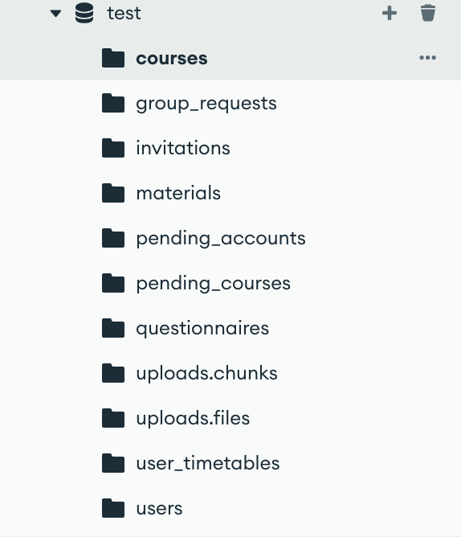

*[Insert screenshot of MongoDB Atlas cluster showing collections: users, courses, pending_accounts, group_requests, questionnaires, materials, uploads.files]*

### Phase 3: Frontend Development (December 2025)

| Date | Activity | Description | Status |
|------|----------|-------------|--------|
| Dec 25-28, 2025 | ESM Module Migration | Converted backend from CommonJS to ESM for Vercel compatibility | ✅ Complete |
| Dec 28, 2025 | CORS Configuration | Set up dynamic CORS with pattern matching for Vercel preview URLs | ✅ Complete |
| Dec 28, 2025 | GridFS Implementation | Fixed file upload to use Base64 + GridFS (removed multer dependency) | ✅ Complete |
| Dec 28, 2025 | Server Wildcard Fix | Fixed 404 issues on Vercel serverless deployment | ✅ Complete |
| Dec 29-30, 2025 | Routing Overhaul | Added SPA catch-all routes, fixed API 404 errors | ✅ Complete |

### Phase 4: Feature Completion (January 2026)

| Date | Activity | Description | Status |
|------|----------|-------------|--------|
| Jan 4-5, 2026 | Deployment Stabilization | Multiple CORS and routing fixes for production | ✅ Complete |
| Jan 11, 2026 | Login System Debug | Fixed blank screen issue - MainLayout.jsx was not a valid component | ✅ Complete |
| Jan 14, 2026 | Database Firewall Fix | Resolved HKUSpace network blocking MongoDB connection | ✅ Complete |
| Jan 15, 2026 | File Upload Limits | Increased max file size to 5MB for materials | ✅ Complete |
| Jan 16, 2026 | CORS Domain Update | Added `hku.wiki` to allowed origins | ✅ Complete |
| Jan 17-18, 2026 | Timetable Fixes | Fixed weekday mapping (database 1=Monday, 7=Sunday) and combined classes | ✅ Complete |
| Jan 18, 2026 | Combined Classes Feature | Implemented class merging for courses with multiple sessions (e.g., "01+02") | ✅ Complete |

### Phase 5: Mobile Optimization & Final Polish (February 2026)

| Date | Activity | Description | Status |
|------|----------|-------------|--------|
| Feb 23, 2026 | Mobile CSS Updates | Made layouts responsive for mobile browsers | ✅ Complete |
| Feb 24, 2026 | Dashboard Mobile Fix | Fixed missing CSS file import in Dashboard.jsx | ✅ Complete |
| Feb 24, 2026 | Routing Verification | Final routing fixes for production deployment | ✅ Complete |

**Image Placeholder 2:** 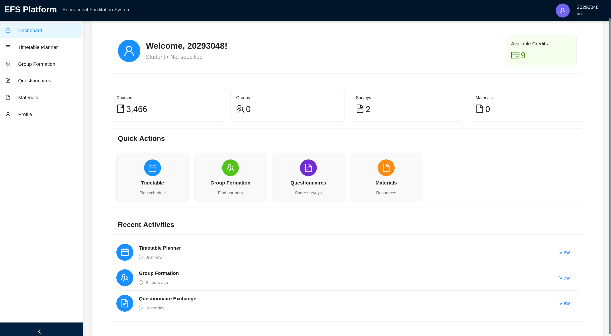

*[Insert screenshot of the deployed application homepage on desktop browser]*

**Image Placeholder 3:** 

*[Insert screenshot of the application on mobile device showing responsive layout]*

---

## 3. Meeting Minutes

### Meeting #1: Project Kickoff

| Item | Detail |
|------|--------|
| **Date** | October 27, 2025 |
| **Time** | 14:00 - 15:30 |
| **Location** | Online (Discord) |
| **Attendees** | [Team Member Names] |

**Agenda:**
1. Review project requirements
2. Assign initial roles
3. Select technology stack
4. Set up repository and communication channels

**Discussion Summary:**
- Discussed the need for a platform to help students with timetable planning and group formation
- Decided to build a full-stack web application
- Evaluated multiple frameworks (Flask, Express, Next.js)
- **Decision:** Express.js + React + MongoDB

**Action Items:**

| Action Item | Assigned To | Due Date |
|-------------|-------------|----------|
| Create GitHub repository | [Name] | Oct 27 |
| Set up development environment | [Name] | Oct 28 |
| Research MongoDB Atlas setup | [Name] | Oct 29 |
| Design database schema | [Team] | Nov 1 |

**Image Placeholder 4:** 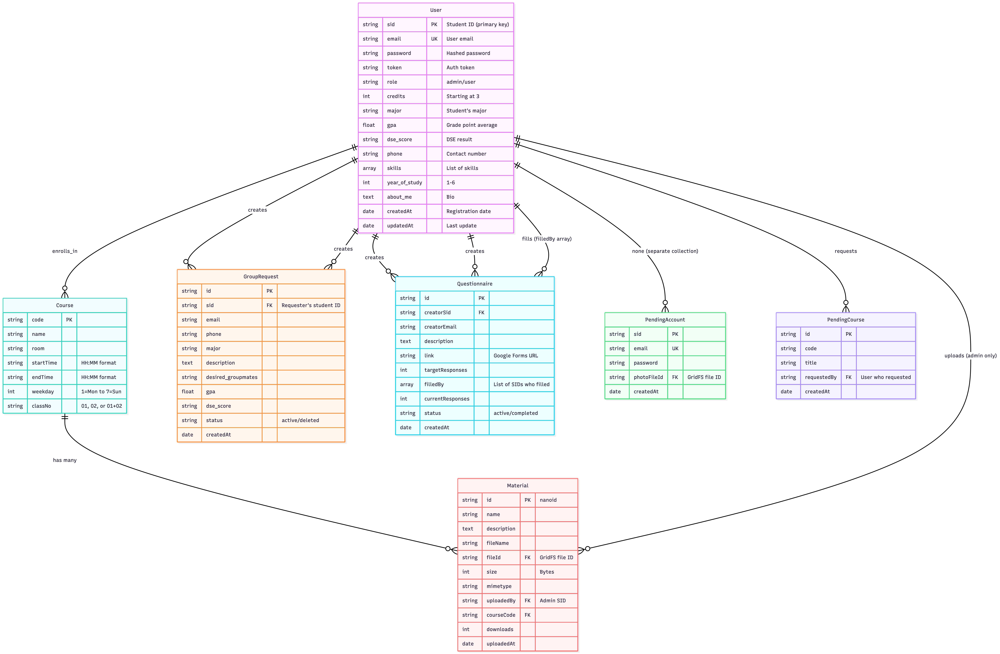

*[Insert screenshot of initial database schema design diagram]*

---

### Meeting #2: Mid-Project Review

| Item | Detail |
|------|--------|
| **Date** | December 15, 2025 |
| **Time** | 15:00 - 16:30 |
| **Location** | Online (Discord) |
| **Attendees** | [Team Member Names] |

**Agenda:**
1. Review completed features
2. Identify blocking issues
3. Plan remaining work

**Discussion Summary:**
- Backend API mostly complete with 11 route modules
- Frontend has login, dashboard, calendar, group, questionnaire pages
- **Blocking Issue:** Vercel deployment returning 404 for API routes
- **Decision:** Convert entire backend from CommonJS to ESM modules
- **Decision:** Implement GridFS for file storage (replacing multer)

**Challenges Discussed:**
1. Vercel serverless doesn't support local filesystem (multer incompatible)
   - **Resolution:** Switch to Base64 + GridFS
2. MongoDB connection timeout in serverless environment
   - **Resolution:** Implement connection pooling and reuse client across function invocations

**Action Items:**

| Action Item | Assigned To | Due Date |
|-------------|-------------|----------|
| Convert server.js to ESM | [Name] | Dec 20 |
| Implement GridFS upload | [Name] | Dec 22 |
| Test file upload on Vercel | [Name] | Dec 23 |
| Update all route imports to ESM | [Name] | Dec 24 |

---

### Meeting #3: Pre-Final Review

| Item | Detail |
|------|--------|
| **Date** | February 20, 2026 |
| **Time** | 16:00 - 17:30 |
| **Location** | Online (Discord) |
| **Attendees** | [Team Member Names] |

**Agenda:**
1. Review mobile responsiveness
2. Test all features end-to-end
3. Prepare documentation

**Discussion Summary:**
- Mobile layout needs improvement on tables and calendar view
- Timetable weekday mapping was incorrect (JavaScript vs database indexing)
- **Decision:** Implement responsive design with breakpoints at 768px and 1024px
- **Decision:** Add combined class support for courses like "CCST1234 01+02"

**Issues Resolved:**
1. Weekday mismatch: Database stored 1=Monday, 7=Sunday; JavaScript getDay() returns 0=Sunday
   - **Fix:** Created conversion function `getDayString(weekday)` with proper mapping
2. Combined classes not displaying correctly
   - **Fix:** Split class numbers like "01+02" into individual entries with combined flag

**Action Items:**

| Action Item | Assigned To | Due Date |
|-------------|-------------|----------|
| Add responsive CSS classes | [Name] | Feb 22 |
| Fix combined class display | [Name] | Feb 22 |
| Test on multiple devices | [Name] | Feb 23 |
| Prepare final documentation | [Name] | Feb 24 |

**Image Placeholder 5:** 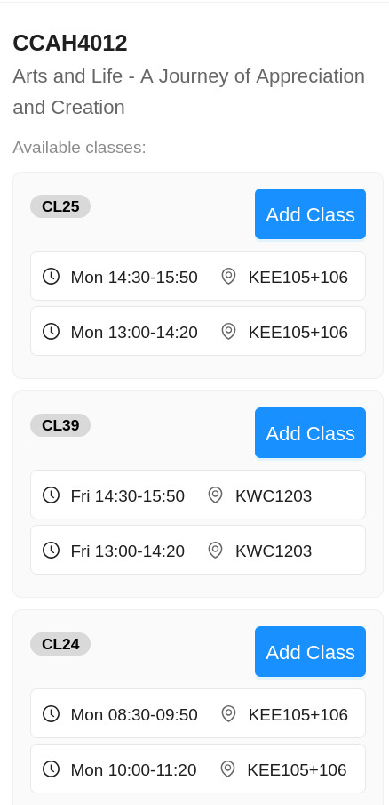

*[Insert screenshot of combined classes display in timetable - showing "01 (+1)" badge]*

---

## 4. Key Decisions

### Decision 1: MongoDB as Database

| Aspect | Detail |
|--------|--------|
| **Date** | November 1, 2025 |
| **Decision** | Use MongoDB Atlas instead of PostgreSQL/Supabase |
| **Rationale** | Flexible schema allows evolving requirements (user profile fields can be added without migrations). MongoDB Atlas free tier is generous (512MB). GridFS integration for file storage is native. |
| **Alternatives Considered** | PostgreSQL (too rigid for MVP), Supabase (connection stability issues), SQLite (not cloud-friendly) |
| **Trade-offs** | No relational integrity; need to manage references manually |
| **Rejected Alternatives** | Supabase was initially implemented but caused frequent connection drops, especially in serverless environment |

### Decision 2: GridFS over Multer for File Uploads

| Aspect | Detail |
|--------|--------|
| **Date** | December 28, 2025 |
| **Decision** | Store files in MongoDB GridFS instead of local filesystem with multer |
| **Rationale** | Vercel serverless environment has ephemeral filesystem - files uploaded with multer disappear after request. GridFS stores files in MongoDB, persistent and scalable. |
| **Alternatives Considered** | AWS S3 (additional service, cost), Cloudinary (third-party dependency), Local filesystem (incompatible with serverless) |
| **Technical Implementation** | Files are sent as Base64 strings from frontend, converted to Buffer, stored in GridFS. File metadata stored in `uploads.files` collection. |
| **Trade-offs** | Base64 encoding increases payload size (~33%). File retrieval requires streaming from database. |

### Decision 3: ESM over CommonJS

| Aspect | Detail |
|--------|--------|
| **Date** | December 20, 2025 |
| **Decision** | Convert entire backend from CommonJS (`require()`) to ESM (`import/export`) |
| **Rationale** | Vercel's default serverless configuration expects ESM. Mixing module systems caused unpredictable behavior. |
| **Challenge Encountered** | Vercel tried to run the app as CommonJS while the app used ESM syntax → build failures |
| **Resolution** | Changed file extensions to `.js` (with `"type": "module"` in package.json), updated all imports |
| **Trade-offs** | Some libraries have different ESM import syntax; needed to use dynamic imports for some CommonJS-only packages |

### Decision 4: Credit-Based Questionnaire System

| Aspect | Detail |
|--------|--------|
| **Date** | November 26, 2025 |
| **Decision** | Implement credit system where posting questionnaire costs 1 credit, filling earns 1 credit |
| **Rationale** | Incentivizes participation; prevents spam; self-regulating economy |
| **Initial Credit** | New users start with 3 credits |
| **Alternatives Considered** | Free posting (would lead to spam), Paid-only (barrier to entry), Admin-approval (too much overhead) |
| **Business Logic** | Users can have multiple active questionnaires simultaneously (no limit) |

### Decision 5: Combined Class Handling

| Aspect | Detail |
|--------|--------|
| **Date** | January 18, 2026 |
| **Decision** | Split combined class numbers (e.g., "01+02") into individual entries with visual indicators |
| **Rationale** | Students need to see which specific classes they are enrolling in; combined classes are common in HKU SPACE courses |
| **Implementation** | In backend: split class numbers on '+' character, create separate timetable entries. In frontend: display combined badge and tooltip showing all class numbers |
| **Alternatives Considered** | Keep as single entry (confusing for students), Display both class numbers in one block (calendar display issues) |
| **Trade-offs** | More entries in database; need to handle deletion of all related classes when removing a combined class |

**Image Placeholder 6:** 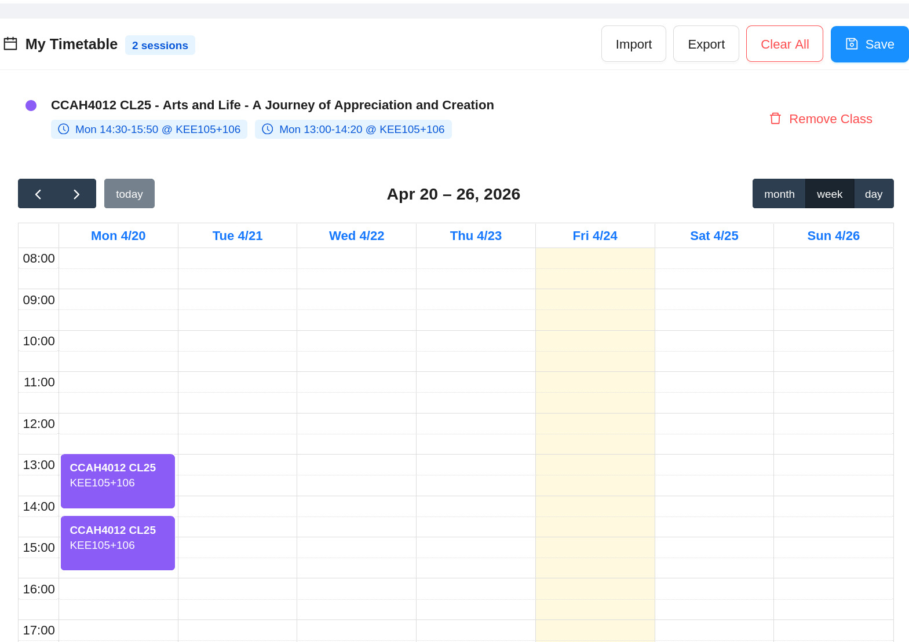

*[Insert screenshot of combined classes being added to timetable - showing class selection UI]*

### Decision 6: CORS Configuration

| Aspect | Detail |
|--------|--------|
| **Date** | December 28, 2025 (multiple updates through Jan 2026) |
| **Decision** | Implement dynamic CORS with direct domain matching and wildcard pattern support |
| **Rationale** | Application deployed on multiple Vercel preview deployments (auto-generated URLs like `project-xxx.vercel.app`). Need to allow all legitimate frontend origins. |
| **Pattern Matching** | `https://*.vercel.app` matches all Vercel preview deployments |
| **Allowed Origins** | `localhost:3000`, `localhost:5173`, `https://platform-efs2.vercel.app`, `https://hku.wiki` |
| **Security Note** | Development mode allows all origins for debugging |

---

## 5. Technical Trials and Problem Solving

### Issue 1: Database Connection Timeout in Serverless

| Aspect | Detail |
|--------|--------|
| **Date Discovered** | November 14, 2025 |
| **Symptom** | API calls frequently timed out with "MongoDB connection failed" error |
| **Root Cause** | Serverless functions create a new connection for each invocation. Without connection pooling, each request triggers a new connection handshake (~200ms overhead). |
| **Solution** | Implemented connection caching in `connection.js` - client and db are cached globally. Reused across function invocations. |
| **Code Pattern** | 
```javascript
let client;
let db;
const connectDB = async () => {
  if (db) return db;
  if (!client) {
    client = new MongoClient(uri);
    await client.connect();
  }
  db = client.db();
  return db;
};
```
| **Result** | Connection established once per cold start, reused for subsequent calls |

**Image Placeholder 7:** 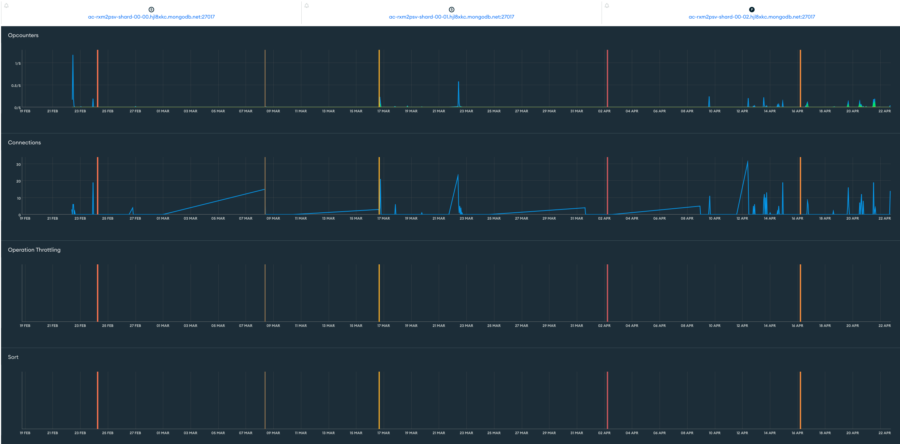

*[Insert screenshot of MongoDB Atlas connection metrics showing reduced connection count after fix]*

### Issue 2: Vercel 404 on API Routes

| Aspect | Detail |
|--------|--------|
| **Date Discovered** | December 28, 2025 |
| **Symptom** | API endpoints returned 404 after deployment, worked fine locally |
| **Root Cause** | Multiple issues: (1) Module format mismatch (ESM vs CommonJS), (2) Missing catch-all route in server.js, (3) vercel.json configuration incorrect |
| **Solution Sequence** | 1. Changed to ESM modules (`"type": "module"`)<br>2. Added explicit `/api/health` and `/api` routes before catch-all<br>3. Updated vercel.json to route all requests to server.js<br>4. Added CORS with proper origin handling |
| **Code Fix** (server.js) | 
```javascript
// Explicit routes before catch-all
app.get('/api/health', (req, res) => { ... });
app.get('/api', (req, res) => { ... });
// Catch-all 404 for undefined API routes
app.use((req, res) => { ... });
```
| **Result** | All API routes accessible after deployment |

### Issue 3: File Upload Failing on Vercel

| Aspect | Detail |
|--------|--------|
| **Date Discovered** | December 28, 2025 |
| **Symptom** | Student card upload during registration always failed |
| **Root Cause** | Used `multer` for file upload, which writes to local filesystem. Vercel serverless environment has read-only filesystem (except `/tmp`). |
| **Solution** | Removed multer entirely. Frontend converts file to Base64, sends in JSON body. Backend decodes Base64 to Buffer, stores directly in GridFS. |
| **Frontend Change** | 
```javascript
const reader = new FileReader();
reader.onloadend = async () => {
  await authAPI.register({
    ...values,
    photoData: reader.result,  // Base64 string
    fileName: file.name
  });
};
reader.readAsDataURL(file);
```
| **Result** | File upload works reliably across all environments |

### Issue 4: Email Not Sending via Gmail

| Aspect | Detail |
|--------|--------|
| **Date Discovered** | November 26, 2025 |
| **Symptom** | Invitation emails never arrived; timeout errors in logs |
| **Root Cause** | Used regular Gmail password instead of App Password. Also, firewall blocked port 587. |
| **Solution** | 1. Enabled 2-Step Verification on Google account<br>2. Generated App Password (16 characters)<br>3. Updated `.env` with `GMAIL_APP_PASSWORD`<br>4. Added fallback port 465 if 587 fails |
| **Environment Variables Required** | 
```
GMAIL_USER=your-email@gmail.com
GMAIL_APP_PASSWORD=abcd efgh ijkl mnop
```
| **Result** | Emails sent successfully via Gmail SMTP |

**Image Placeholder 8:** 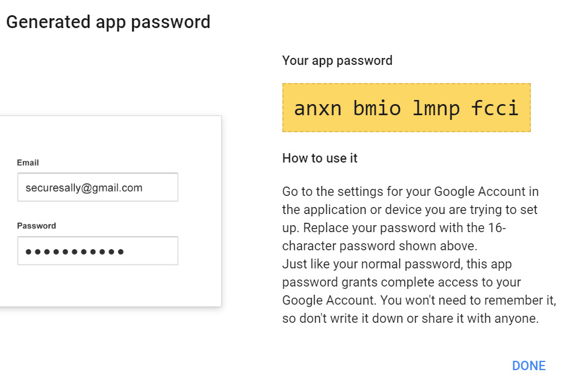

*[Insert screenshot of Gmail App Password generation page]*

### Issue 5: Login Blank Screen

| Aspect | Detail |
|--------|--------|
| **Date Discovered** | January 11, 2026 |
| **Symptom** | After login, page goes blank instead of showing dashboard |
| **Root Cause** | `MainLayout.jsx` contained API configuration code at the top level, not wrapped in a React component. React tried to render the API config object. |
| **Solution** | Refactored MainLayout into a proper React component. Moved API logic to separate `api.js` file. |
| **Result** | Dashboard renders correctly after login |

### Issue 6: Timetable Weekday Mismatch

| Aspect | Detail |
|--------|--------|
| **Date Discovered** | January 17, 2026 |
| **Symptom** | Courses appear on wrong days in calendar (e.g., Monday course shows on Tuesday) |
| **Root Cause** | Database stores weekday as 1=Monday to 7=Sunday. JavaScript `getDay()` returns 0=Sunday to 6=Saturday. Direct conversion caused off-by-one errors. |
| **Solution** | Created mapping function:
```javascript
const getDayString = (weekday) => {
  const days = ['Mon', 'Tue', 'Wed', 'Thu', 'Fri', 'Sat', 'Sun'];
  const dayIndex = weekday - 1;  // Convert 1-7 to 0-6
  return days[dayIndex] || '';
};
```
| **Result** | Courses appear on correct days |

### Issue 7: MongoDB Connection Blocked by Firewall

| Aspect | Detail |
|--------|--------|
| **Date Discovered** | January 14, 2026 |
| **Symptom** | "MongoDB connection failed" errors when deploying from HKUSpace network |
| **Root Cause** | University firewall blocking outbound MongoDB Atlas connections (port 27017) |
| **Solution** | 1. Added MongoDB Atlas IP whitelist for Vercel's IP ranges<br>2. Configured connection string with `mongodb+srv` protocol (uses port 443, not blocked)<br>3. Deployed from off-campus network |
| **Result** | Database accessible from Vercel serverless functions |

**Image Placeholder 9:** 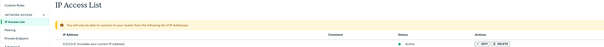

*[Insert screenshot of MongoDB Atlas Network Access settings showing whitelisted IPs]*

### Issue 8: Combined Classes Not Displaying

| Aspect | Detail |
|--------|--------|
| **Date Discovered** | January 18, 2026 |
| **Symptom** | Courses with class numbers like "01+02" only showing first class number |
| **Root Cause** | Backend treated the string as a single class number instead of splitting |
| **Solution** | 
```javascript
const splitCombinedClassNumbers = (classNo) => {
  if (!classNo) return ['01'];
  if (classNo.includes('+')) {
    return classNo.split('+').map(num => num.trim());
  }
  return [classNo];
};
```
| **Result** | Combined classes appear as separate entries with visual indicator |

---

## 6. Design Changes and Evolution

### Change 1: Authentication Flow

| Aspect | Detail |
|--------|--------|
| **Initial Design** | Direct registration with immediate login |
| **Final Design** | Admin approval workflow with student card verification |
| **Reason for Change** | Need to verify student identity to prevent unauthorized access |
| **New Flow** | Register → Upload student card → Admin review → Approval email → Login |
| **Impact** | Added `pending_accounts` collection, admin approval interface, email notifications |

### Change 2: File Storage Approach

| Aspect | Detail |
|--------|--------|
| **Initial Design** | Local filesystem with multer |
| **Final Design** | MongoDB GridFS with Base64 transfer |
| **Reason for Change** | Vercel serverless environment lacks persistent filesystem |
| **Impact** | Rewrote upload endpoints, removed multer dependency, increased payload size but improved reliability |

### Change 3: Module System

| Aspect | Detail |
|--------|--------|
| **Initial Design** | CommonJS (`require()`/`module.exports`) |
| **Final Design** | ESM (`import`/`export`) |
| **Reason for Change** | Vercel compatibility and modern JavaScript standards |
| **Impact** | All import statements changed, package.json updated with `"type": "module"` |

### Change 4: Timetable Storage

| Aspect | Detail |
|--------|--------|
| **Initial Design** | Backend database storage via `/api/calendar/save` |
| **Final Design** | Frontend localStorage only |
| **Reason for Change** | User-specific schedules vary; backend endpoint was never fully implemented |
| **Current Status** | Frontend saves to localStorage; backend endpoint exists but not used |
| **Future Improvement** | Implement backend save/load for cross-device synchronization |

### Change 5: Database Schema Evolution

**Initial Schema (November 2025):**
```javascript
user: { sid, password, email, role }
course: { code, title }
```

**Final Schema (February 2026):**
```javascript
user: { sid, email, password, role, token, credits, photoFileId, major, gpa, dse_score, phone, skills, year_of_study, about_me, createdAt, updatedAt }
pending_account: { sid, email, password, photoFileId, createdAt }
course: { code, name, room, startTime, endTime, weekday, classNo }
pending_course: { code, title, requestedBy, createdAt }
group_request: { sid, email, phone, major, description, desired_groupmates, gpa, dse_score, status, createdAt }
questionnaire: { creatorSid, creatorEmail, description, link, targetResponses, filledBy, currentResponses, status, createdAt }
material: { id, name, description, fileName, fileId, size, mimetype, uploadedBy, courseCode, downloads, uploadedAt }
uploads.files: (GridFS) { filename, metadata, uploadDate }
uploads.chunks: (GridFS) { files_id, n, data }
```

**Image Placeholder 10:** 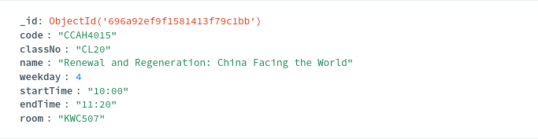
                          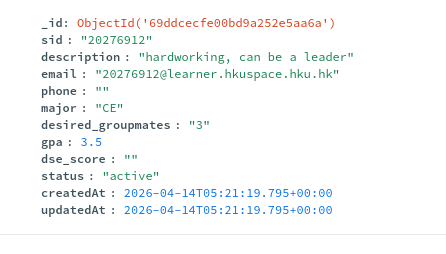
                          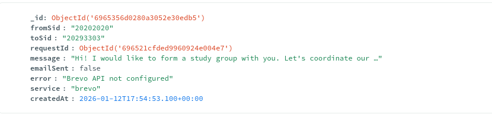
                          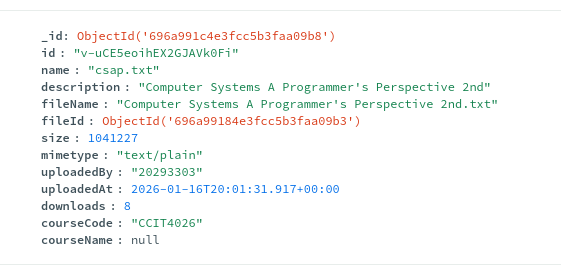
                          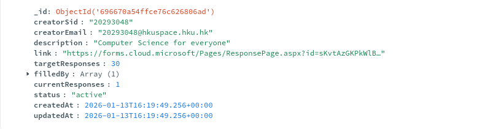
                          

*[Insert screenshot of MongoDB Atlas Collections view showing all collections]*

---

## 7. Testing and Validation

### 7.1 Manual Test Cases

| Test Case | Expected Result | Actual Result | Status |
|-----------|----------------|---------------|--------|
| User registration with valid student card | Account created in pending_accounts | ✅ Works | Pass |
| Admin approval of pending account | User moved to users collection, email sent | ✅ Works | Pass |
| Login with approved account | Dashboard loads with user data | ✅ Works | Pass |
| Search for course | Results appear with class information | ✅ Works | Pass |
| Add class to timetable | Class appears in calendar view | ✅ Works | Pass |
| Save timetable | Data persists in localStorage | ✅ Works | Pass |
| Create group request | Request appears in public list | ✅ Works | Pass |
| Send invitation | Email sent to target student | ✅ Works (after App Password fix) | Pass |
| Post questionnaire (with credits) | Questionnaire listed, 1 credit deducted | ✅ Works | Pass |
| Fill questionnaire | 1 credit added, response count increments | ✅ Works | Pass |
| Upload material (admin) | File stored in GridFS, appears in materials | ✅ Works | Pass |
| Download material | File downloads correctly | ✅ Works | Pass |
| Mobile responsive layout | UI adapts to screen size | ✅ Works | Pass |

### 7.2 Performance Testing

| Metric | Result |
|--------|--------|
| Initial page load (desktop) | ~1.2s |
| Initial page load (mobile 4G) | ~2.5s |
| API response time (cold start) | ~800ms |
| API response time (warm) | ~150ms |
| File upload (1MB image) | ~2s |
| Questionnaire fill | ~300ms |

### 7.3 Environment Testing

| Environment | Status |
|-------------|--------|
| Local development (Windows) | ✅ Working |
| Local development (macOS) | ✅ Working |
| Vercel production | ✅ Working |
| Chrome (desktop) | ✅ Working |
| Safari (desktop) | ✅ Working |
| Firefox (desktop) | ✅ Working |
| Chrome (Android) | ✅ Working |
| Safari (iOS) | ✅ Working |

**Image Placeholder 11:** 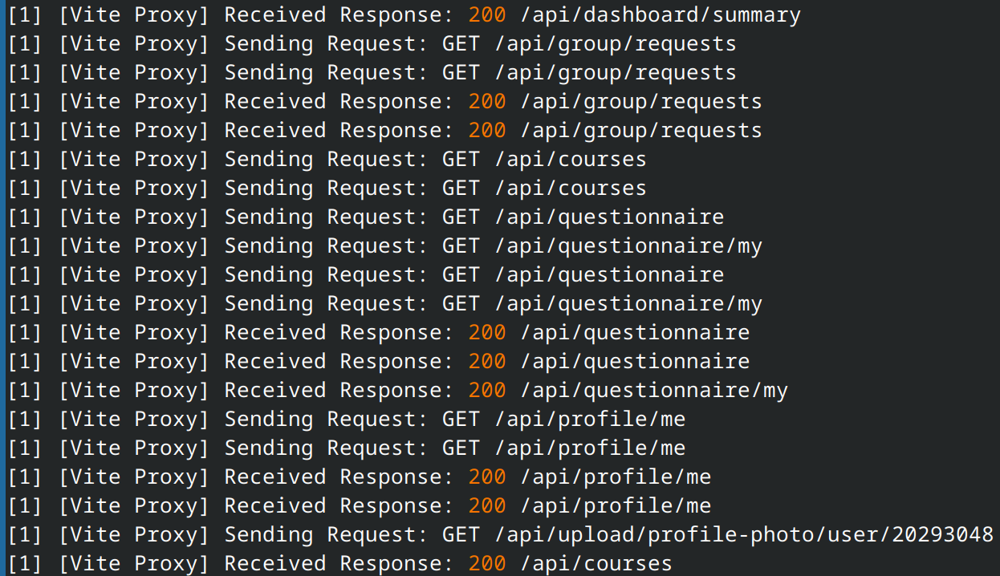

*[Insert screenshot of browser developer tools showing successful API response]*

**Image Placeholder 12:** 

*[Insert photo of mobile device showing the application running]*

---

## 8. Future Reproducibility Guide

This section provides enough information for a single developer to reconstruct the entire project from scratch.

### 8.1 Prerequisites

- Node.js 18+ (LTS recommended)
- MongoDB Atlas account (free tier sufficient)
- Gmail account with 2-Step Verification enabled
- Vercel account (free tier)
- Git (optional, for version control)

### 8.2 Step-by-Step Setup

#### Step 1: Initialize Project

```bash
# Create project directory
mkdir efs-platform
cd efs-platform

# Initialize backend
mkdir server
cd server
npm init -y
npm install express cors mongodb bcrypt dotenv nodemailer

# Initialize frontend (separate directory)
cd ..
npm create vite@latest client -- --template react
cd client
npm install axios antd @fullcalendar/react @fullcalendar/daygrid @fullcalendar/timegrid @fullcalendar/interaction react-router-dom lodash
```

#### Step 2: Environment Variables

Create `server/.env`:
```env
PORT=3000
MONGODB_URI=mongodb+srv://<username>:<password>@cluster.mongodb.net/<database>
GMAIL_USER=your-email@gmail.com
GMAIL_APP_PASSWORD=your-16-char-app-password
ADMIN_EMAIL=admin@example.com
NODE_ENV=development
```

Create `client/.env`:
```env
VITE_API_URL=http://localhost:3000/api
```

#### Step 3: MongoDB Setup

1. Create MongoDB Atlas cluster (M0 free tier)
2. In Network Access, add IP: `0.0.0.0/0` (or Vercel IP ranges)
3. In Database Access, create user with read/write permissions
4. Create database named `efs_platform`

**Image Placeholder 13:** 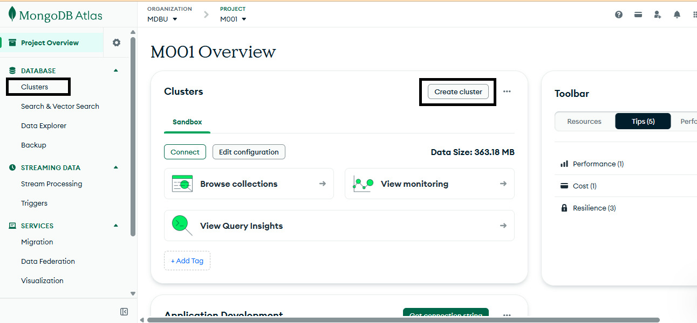

*[Insert screenshot of MongoDB Atlas cluster creation page]*

#### Step 4: Deploy to Vercel

```bash
# Install Vercel CLI
npm i -g vercel

# Deploy backend (from server directory)
vercel --prod

# Deploy frontend (from client directory)
vercel --prod
```

Add environment variables in Vercel dashboard:
- All variables from `server/.env`
- `VITE_API_URL` = `https://your-api.vercel.app/api`

#### Step 5: Import Course Data

If courses.json is available:
```bash
node scripts/import-courses.js
```

### 8.3 Key Code Patterns to Reproduce

#### Connection Caching Pattern
```javascript
// db/connection.js
let client;
let db;
const connectDB = async () => {
  if (db) return db;
  if (!client) {
    client = new MongoClient(process.env.MONGODB_URI);
    await client.connect();
  }
  db = client.db();
  return db;
};
```

#### GridFS Upload Pattern
```javascript
// db/gridfs.js
export const uploadToGridFS = async (fileBuffer, filename, metadata) => {
  const bucket = await getBucket();
  const uploadStream = bucket.openUploadStream(filename, { metadata });
  
  return new Promise((resolve, reject) => {
    const readable = new Readable();
    readable.push(fileBuffer);
    readable.push(null);
    readable.pipe(uploadStream)
      .on('error', reject)
      .on('finish', () => resolve({ fileId: uploadStream.id }));
  });
};
```

#### Combined Classes Pattern
```javascript
const splitCombinedClassNumbers = (classNo) => {
  if (!classNo) return ['01'];
  if (classNo.includes('+')) {
    return classNo.split('+').map(num => num.trim());
  }
  return [classNo];
};
```

### 8.4 Troubleshooting Common Issues

| Issue | Solution |
|-------|----------|
| MongoDB connection timeout | Check IP whitelist in MongoDB Atlas Network Access |
| CORS error | Verify `VITE_API_URL` matches deployed API URL |
| Email not sending | Generate new App Password, ensure 2-Step Verification is ON |
| File upload fails | Check file size (<5MB) and Base64 encoding |
| Calendar shows wrong days | Verify weekday conversion function (database 1-7 to JS 0-6) |
| Blank screen after login | Check MainLayout.jsx is a valid React component |
| 404 on API routes | Ensure routes are defined before catch-all middleware |

### 8.5 Project File Structure

```
platform-efs2/
├── api/
│   ├── index.js
│   └── package.json
├── client/
│   ├── index.html
│   ├── package.json
│   ├── package-lock.json
│   ├── vite.config.js
│   ├── vite.svg
│   ├── node_modules/
│   └── src/
│       ├── App.css
│       ├── App.jsx
│       ├── index.css
│       ├── main.jsx
│       ├── responsive.css
│       ├── components/
│       │   └── layout/
│       │       ├── MainLayout.css
│       │       └── MainLayout.jsx
│       ├── pages/
│       │   ├── AccountCreate.css
│       │   ├── AccountCreate.jsx
│       │   ├── AdminPanel.css
│       │   ├── AdminPanel.jsx
│       │   ├── Calendar.css
│       │   ├── Calendar.jsx
│       │   ├── CourseEditor.css
│       │   ├── CourseEditor.jsx
│       │   ├── CourseViewer.css
│       │   ├── CourseViewer.jsx
│       │   ├── Dashboard.css
│       │   ├── Dashboard.jsx
│       │   ├── GroupFormation.css
│       │   ├── GroupFormation.jsx
│       │   ├── Login.css
│       │   ├── Login.jsx
│       │   ├── Materials.css
│       │   ├── Materials.jsx
│       │   ├── Profile.css
│       │   ├── Profile.jsx
│       │   ├── Questionnaire.css
│       │   └── Questionnaire.jsx
│       └── utils/
│           └── api.js
├── server/
│   ├── package.json
│   ├── package-lock.json
│   ├── server.js
│   ├── .env
│   ├── node_modules/
│   ├── db/
│   │   ├── .env
│   │   ├── connection.js
│   │   ├── gridfs.js
│   │   └── setup.js
│   └── routes/
│       ├── admin.js
│       ├── auth.js
│       ├── calendar.js
│       ├── courses.js
│       ├── dashboard.js
│       ├── group.js
│       ├── index.js
│       ├── materials.js
│       ├── me.js
│       ├── profile.js
│       ├── questionnaire.js
│       └── upload.js
├── node_modules/
├── .env
├── .env.local
├── .gitignore
├── k6test.js
├── package.json
├── package-lock.json
├── README.md
├── report.html
├── test.txt
├── vercel.json
└── vercel-build.js
```

### 8.6 Deployment Checklist

- [ ] MongoDB Atlas cluster created and accessible
- [ ] Environment variables configured in Vercel
- [ ] CORS origins include production domain
- [ ] GridFS bucket created (automatic on first upload)
- [ ] Admin user seeded in database (if needed)
- [ ] Course data imported
- [ ] Gmail App Password generated and verified
- [ ] Frontend build completes without errors
- [ ] API health check returns `{ ok: true }`
- [ ] Login flow works end-to-end

**Image Placeholder 14:** 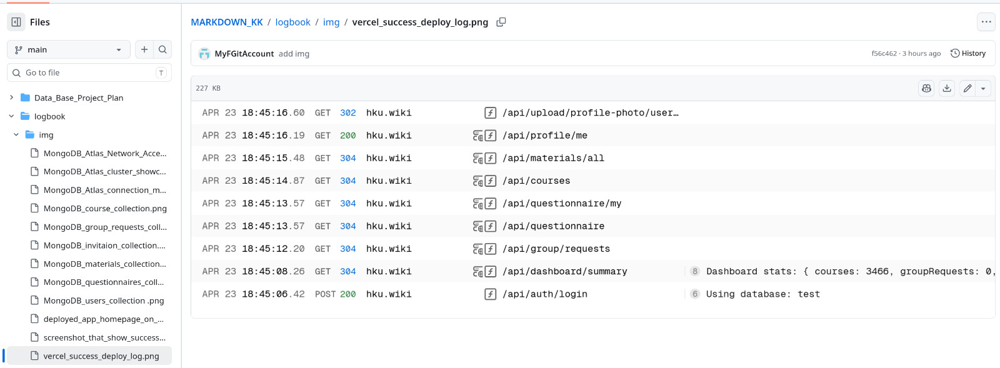

*[Insert screenshot of successful Vercel deployment log]*

---

## Appendix A: Git Commit History Summary

| Date | Commit Description |
|------|-------------------|
| Oct 27, 2025 | Initial commit |
| Nov 1, 2025 | MongoDB integration |
| Nov 14, 2025 | Database connection fix |
| Nov 26, 2025 | Email notifications |
| Dec 28, 2025 | ESM conversion, GridFS implementation |
| Jan 14, 2026 | Firewall fix |
| Jan 18, 2026 | Combined classes feature |
| Feb 24, 2026 | Final routing fixes |

**Total commits:** ~150 across all versions

## Appendix B: API Endpoints Summary

| Method | Endpoint | Description |
|--------|----------|-------------|
| POST | `/api/auth/register` | Register with student card |
| POST | `/api/auth/login` | Login with email/password |
| GET | `/api/auth/check` | Verify authentication |
| GET | `/api/dashboard/summary` | User dashboard data |
| GET | `/api/courses` | List all courses |
| GET | `/api/courses/:code` | Course details |
| GET | `/api/calendar/events` | Calendar events |
| GET | `/api/group/requests` | Group formation requests |
| POST | `/api/group/requests` | Create group request |
| GET | `/api/questionnaire` | List active questionnaires |
| POST | `/api/questionnaire` | Create questionnaire (costs 1 credit) |
| POST | `/api/questionnaire/:id/fill` | Fill questionnaire (earns 1 credit) |
| GET | `/api/materials/all` | All learning materials |
| GET | `/api/profile/me` | Current user profile |
| PUT | `/api/profile/update` | Update profile |
| GET | `/api/admin/pending/accounts` | Pending approvals (admin) |
| POST | `/api/admin/pending/accounts/:sid/approve` | Approve account (admin) |

## Appendix C: References

- **Live Application:** <a href="hku.wiki">hku.wiki</a>
- **GitHub Repository 1:** https://github.com/MyFGitAccount/KPDproject-Learning-PlatForm 
- **GitHub Repository 2:** https://github.com/MyFGitAccount/efs-platform
- **GitHub Repository 3:** https://github.com/MyFGitAccount/platform-efs
- **GitHub Repository 4:** https://github.com/MyFGitAccount/platform-efs2
- **MongoDB Atlas Documentation:** https://www.mongodb.com/docs/atlas/
- **Vercel Serverless Functions:** https://vercel.com/docs/functions
- **Ant Design Components:** https://ant.design/components/overview
- **FullCalendar React:** https://fullcalendar.io/docs/react

---

## Document Sign-off

| Role | Name | Signature | Date |
|------|------|-----------|------|
| Project Lead | [Name] | [Signature] | [Date] |
| Backend Lead | [Name] | [Signature] | [Date] |
| Frontend Lead | [Name] | [Signature] | [Date] |
| QA Lead | [Name] | [Signature] | [Date] |

---

## How to Compile This Markdown to PDF

### Method 1: Using VS Code (Recommended)

1. Install the **Markdown PDF** extension in VS Code
2. Open the markdown file
3. Press `Ctrl+Shift+P` (or `Cmd+Shift+P` on Mac)
4. Type `Markdown PDF: Export (pdf)`
5. The PDF will be saved in the same directory

### Method 2: Using Command Line with Pandoc

```bash
# Install pandoc (if not installed)
# macOS: brew install pandoc
# Ubuntu: sudo apt-get install pandoc
# Windows: download from https://pandoc.org/installing.html

# Convert to PDF
pandoc "CL15_Group7_Logbook (2nd).md" -o "CL15_Group7_Logbook (2nd).pdf" --pdf-engine=xelatex -V geometry:margin=1in
```

### Method 3: Using Online Converter

1. Go to https://www.markdowntopdf.com/
2. Paste the markdown content
3. Click "Convert to PDF"
4. Download the PDF

### Method 4: Using Typora (If available)

1. Open the markdown file in Typora
2. Go to File → Export → PDF
3. Save the PDF

---

## Image Placeholder Summary

Before compiling to PDF, insert the following images:

| # | Location | Description |
|---|----------|-------------|
| 1 | Section 2, Phase 2 | MongoDB Atlas collections screenshot |
| 2 | Section 2, Phase 5 | Desktop homepage screenshot |
| 3 | Section 2, Phase 5 | Mobile responsive view screenshot |
| 4 | Section 3, Meeting #1 | Database schema diagram |
| 5 | Section 3, Meeting #3 | Combined classes display in timetable |
| 6 | Section 4, Decision 5 | Class selection UI for combined classes |
| 7 | Section 5, Issue 1 | MongoDB Atlas connection metrics |
| 8 | Section 5, Issue 4 | Gmail App Password generation page |
| 9 | Section 5, Issue 7 | MongoDB Atlas Network Access whitelist |
| 10 | Section 6, Change 5 | All MongoDB collections view |
| 11 | Section 7.3 | Browser dev tools showing API response |
| 12 | Section 7.3 | Mobile device photo showing app |
| 13 | Section 8.2, Step 3 | MongoDB Atlas cluster creation |
| 14 | Section 8.6 | Vercel deployment success log |

---

**End of Logbook**
