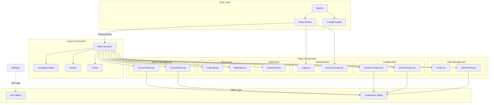

```mermaid
graph TD
    subgraph "Root Level"
        APP[App.jsx]
        RL[React Router]
        CP[ConfigProvider]
    end
    
    subgraph "Layout Component"
        ML[MainLayout.jsx]
        NAV[Navigation Menu]
        HEAD[Header]
        FOOT[Footer]
    end
    
    subgraph "Page Components"
        subgraph "Authentication"
            LG[Login.jsx]
            AC[AccountCreate.jsx]
        end
        
        subgraph "Dashboard"
            DB[Dashboard.jsx]
        end
        
        subgraph "Course Management"
            CV[CourseViewer.jsx]
            CE[CourseEditor.jsx]
        end
        
        subgraph "Collaboration"
            GF[GroupFormation.jsx]
            QN[Questionnaire.jsx]
        end
        
        subgraph "Resources"
            CL[Calendar.jsx]
            MT[Materials.jsx]
        end
        
        subgraph "User Management"
            PF[Profile.jsx]
            AP[AdminPanel.jsx]
        end
    end
    
    subgraph "Utility Layer"
        API[API Utilities]
        CSS[Component Styles]
    end
    
    APP --> RL
    APP --> CP
    RL -->|Authenticated| ML
    ML --> NAV
    ML --> HEAD
    ML --> FOOT
    
    RL --> LG
    RL --> AC
    
    ML --> DB
    ML --> CV
    ML --> CE
    ML --> GF
    ML --> QN
    ML --> CL
    ML --> MT
    ML --> PF
    ML --> AP
    
    CV --> CSS
    CE --> CSS
    GF --> CSS
    QN --> CSS
    AP --> CSS
    
    allPages -.->|API Calls| API

```
