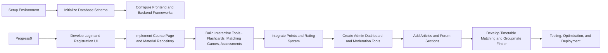

#  Project Stack & Cost Overview

##  Tech Stack: MERN

| Layer        | Technology               | Notes                                  |
|--------------|---------------------------|----------------------------------------|
| **Database** | MongoDB (Atlas)           | Cloud-hosted, scalable NoSQL database  |
| **Backend**  | Express.js                | Lightweight Node.js framework          |
| **Frontend** | React                     | Component-based UI library             |
| **Runtime**  | Node.js                   | Fast, event-driven JavaScript runtime  |
| **Forum**    | Discourse (self-hosted or paid) | Robust community platform         |

---

##  Potential Cost Breakdown

| Category               | Option(s)              | Estimated Monthly Cost (USD)/(HKD) | Notes(USD) |
|------------------------|------------------------|------------------------------|-------|
| **Computers**          | Three laptops          | **$848/$6592**                     |Lenovo IdeaPad 3 (282.85*3)
| **Server & Hosting**   | **DigitalOcean**       | **$12/$93**                      | Basic Droplet: 1 vCPU, 2 GB RAM, 50 GB SSD → Docker deployment adds **no extra cost** Use `docker-compose.yml` for one-click setup |
|                        | **Hetzner**            | **$4/$31**                       | CX11 VPS: 1 vCPU, 2 GB RAM, 20 GB SSD Cheapest Docker-compatible option |
| **Database**           | **MongoDB Atlas**      | **$0** (M0 free) **$9+/$70+** (M2/M5) | M0: 512 MB shared M2 ($9/mo): 2 GB M5 ($25/mo): 5 GB |
|                        | **Supabase**           | **$0** (free) **$25+/$194+** (Pro) | Free: 500 MB DB Pro ($25/mo): 8 GB |
| **Forum**              | **Discourse**          | **$0** (self-hosted) **$100** (hosted) | Official Docker image → `docker pull discourse/discourse` Zero cost when self-hosted on your VPS |
| **Email Verification** | **Gmail SMTP**         | **$0**                       | ~500 emails/day limit Works perfectly in Docker with environment variables |
|                        | **SendPulse**          | **$0**                       | 12,000 emails/month free |
| **Domain Name**        | **Namecheap**          | **$1–$2/$8-$16**                    | `.com` ≈ $10–15/year (first year often $1) |
|                        | **Cloudflare Registrar**| **$1–$2/$8-$16**                   | `.com` ≈ $10/year + free DNS/security |
| **Backup & Storage**   | **AWS S3**             | **$0.005/$0.04**  (10 GB)            | $0.005/GB/month |
|                        | **IDrive**       | **$0** (10 GB)            |  **cheapest option (free!)** |                                                         
|                        |                  |                           |  **total: $853-987  (The first month)     &nbsp;&nbsp;&nbsp;&nbsp;&nbsp;&nbsp;&nbsp;: $5-145 (per month)**

---

## Role Breakdown

```mermaid
graph TD
  Root[HKU SPACE Learning Platform Project]

  Root --> A[Member A - Backend & Infrastructure]
  A --> A1[Authentication System]
  A1 --> A1a[Login with Course Code Validation]
  A1 --> A1b[First-Time User Registration Flow]
  A --> A2[Database Schema Design]
  A --> A3[Admin Dashboard Backend]
  A --> A4[Points & Rating Logic]
  A --> A5[Timetable Matching & Groupmate Finder]
  A --> A6[API for Material Upload & Retrieval]

  Root --> B[Member B - Frontend & User Experience]
  B --> B1[Login & Registration UI]
  B --> B2[Course Page Interface]
  B2 --> B2a[Material Repository Viewer]
  B2 --> B2b[Interactive Tools - Flashcards, Matching Games]
  B --> B3[Articles & Forum UI]
  B --> B4[Rating Interface]
  B --> B5[Responsive Design & Accessibility]
  B --> B6[User Profile & Avatar System]

  Root --> C[Member C - Integration, Testing & Admin Tools]
  C --> C1[Discourse Forum Integration]
  C --> C2[Email Verification System]
  C --> C3[Admin Dashboard Interface]
  C --> C4[Search & Filter Tools]
  C --> C5[Testing & Validation]
  C --> C6[Deployment & Documentation]
```

 
---

## WorkFlow

---
