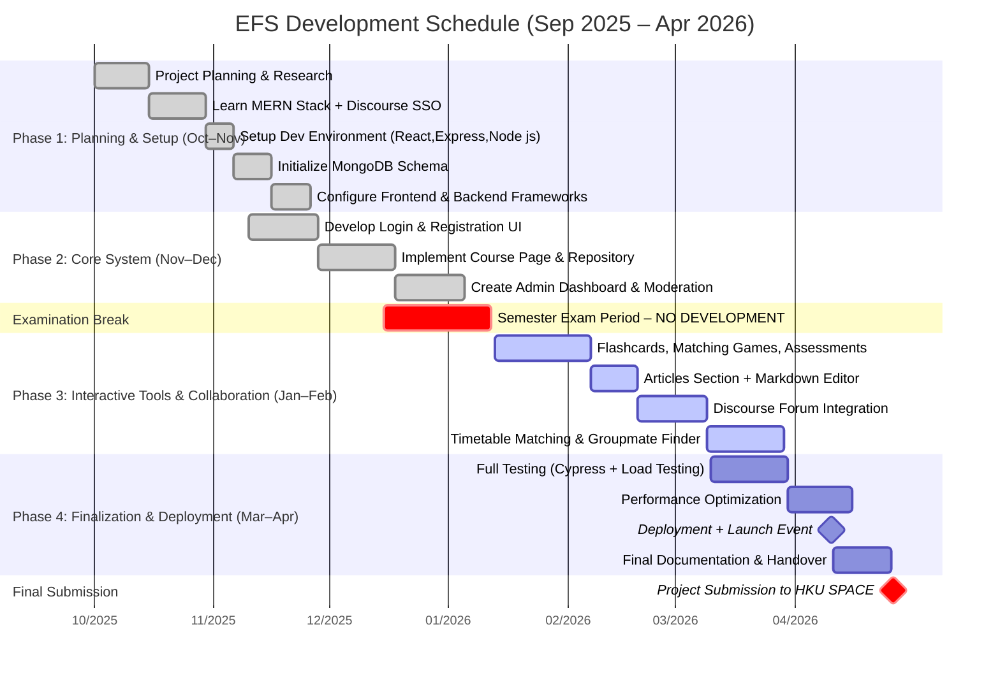

#  Project Stack & Cost Overview

##  Tech Stack: MERN

| Layer      | Technology      | Notes                                 |
| ---------- | --------------- | ------------------------------------- |
| *Database* | MongoDB (Atlas) | Cloud-hosted, scalable NoSQL database |
| *Backend*  | Express.js      | Lightweight Node.js framework         |
| *Frontend* | React           | Component-based UI library            |
| *Runtime*  | Node.js         | Fast, event-driven JavaScript runtime |

---

##  Potential Cost Breakdown

| Category               | Option(s)                | Estimated Monthly Cost (USD)/(HKD)        | Notes(USD)    | Reality budget(USD) |
| ---------------------- | ------------------------ | ----------------------------------------- |---------------|--------| 
| **Computers**          | Three laptops            | **$848/$6592**                            | Lenovo IdeaPad 3 (282.85*3) |Due to we already have three laptops, in reality we don't need to count it on budget|
| **Server & Hosting**   | **DigitalOcean**         | **$12/$93**                               | Basic Droplet: 1 vCPU, 2 GB RAM, 50 GB SSD → Docker deployment adds **no extra cost** Use `docker-compose.yml` for one-click setup | **$12** |
|                        | **Hetzner**              | **$4/$31**                                | CX11 VPS: 1 vCPU, 2 GB RAM, 20 GB SSD Cheapest Docker-compatible option       |  **$4**      |
| **Database**           | **MongoDB Atlas**        | **$0** (M0 free) **$9+/$70+** (M2/M5)  | M0: 512 MB shared M2 ($9/mo): 2 GB M5 ($25/mo): 5 GB  | **$0-9**                |
|                        | **Supabase**             | **$0** (free) **$25+/$194+** (Pro)     | Free: 500 MB DB Pro ($25/mo): 8 GB         | **$0-25**  | 
| **Email Verification** | **Gmail SMTP**           | **$0**                                    | ~500 emails/day limit Works perfectly in Docker with environment variables     | **$0** |
|                        | **Brevo**            | **$0-9/$0-70**                                    | 300-100k emails/day free    | **$0** |
| **Domain Name**        | **Namecheap**            | **$1–$2/$8-$16**                          | `.com` ≈ $10–15/year (first year often $1)        | **$1-2**   |
|                        | **Cloudflare Registrar** | **$1–$2/$8-$16**                          | `.com` ≈ $10/year + free DNS/security   | **$1-2**   |
| **Backup & Storage**   | **AWS S3**               | **$0.005/$0.04**  (10 GB)              | $0.005/GB/month     | **$0.005** |
|                        | **IDrive**               | **$0** (10 GB)                            | **cheapest option (free!)**  | **$0** |
| **AI token**           | **Cursor Pro**           | **$20/$155**                              | $20 USD per month            | In  reality we have free user token so we are not going to count this | 
|                        | **Windsurf**             | **$16/$124**                              | $16 USD per month            | In  reality we have free user token so we are not going to count this | 
|                        |                          |                                           | **total: $869-916  (The first month)     &nbsp;&nbsp;&nbsp;&nbsp;&nbsp;&nbsp;&nbsp;: $21-68 (per month)**                  | **total: $21-59 (per month)** |

---

## Role Breakdown

```mermaid
graph TD
  Root[HKU SPACE Learning Platform Project]

  Root --> A[Young Ho Tim - Backend & Infrastructure]
  A --> A1[Authentication System]
  A1 --> A1a[Login with Course Code Validation]
  A1 --> A1b[First-Time User Registration Flow]
  A --> A2[Database Schema Design]
  A --> A3[Admin Dashboard Backend]
  A --> A4[Timetable Matching & Groupmate Finder]
  A --> A5[API for Material Upload & Retrieval]

  Root --> B[Kwok Ho Yin - Frontend & User Experience]
  B --> B1[Login & Registration UI]
  B --> B2[Course Page Interface]
  B2 --> B2a[Material Repository Viewer]
  B --> B3[Articles]
  B --> B4[Rating Interface]
  B --> B5[Responsive Design & Accessibility]
  B --> B6[User Profile & Avatar System]
  B --> B7[Contact with supervisor]

  Root --> C[Xavier Wong - Integration, Testing & Admin Tools]
  C --> C1[Email Verification System]
  C --> C2[Admin Dashboard Interface]
  C --> C3[Search & Filter Tools]
  C --> C4[Testing & Validation]
  C --> C5[Deployment & Documentation]
```

 
---

## WorkFlow

---

| The reason Problem                                          | EFS Solution                                                                                                |
| ------------------------------------------------ | ----------------------------------------------------------------------------------------------------------- |
| **1. Add-Drop Period Complexity**                | EFS provides a drag-and-drop timetable planner that replaces handwritten scheduling and speeds up planning. |
| - Course documents are too long                  | Students can filter and visualize course blocks instead of reading lengthy PDFs.                            |
| - Too much irrelevant info                       | Only searched course data is shown in the list planner.                                                         |
| - Manual time slot writing is inefficient        | Timetable blocks are interactive                                                         |
| - Hard to find your own class                    | Search and filter by course code, semester, or weekday.                                                     |
|                                                  |                                                                                                             |
| **2. Lack of Learning Resources**                | EFS promotes clarity through extra notes, mock papers, slides, and searchable repositories. (Celendro, 2023)                 |
|                                                  | Students can upload and browse materials by topic, format, or popularity.                                   |
|                                                  |                                                                                                             |
| **3. High Demand for Questionnaire Respondents** | EFS includes a token-based questionnaire exchange: view requires 3 tokens, earned by completing others.     |
|                                                  | This creates an extra way let students exchange their questionnaire, incentive-driven system for survey sharing.                                            |
|                                                  |                                                                                                             |
| **4. Freeriding & Uneven Group Ability**         | EFS forms groups based on contribution and academic input (e.g., DSE/GPA scores).                                                                            
|                                                  | The function provide a new way for students do group formation, reduce the risk of freeriding and uneven group ability.|
