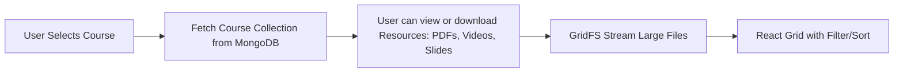

```mermaid
flowchart LR
    A[User Selects Course] --> B[Fetch Course Collection from MongoDB]
    B --> C[User can view or download Resources: PDFs, Videos, Slides]
    C --> D[GridFS Stream Large Files]
    D --> E[React Grid with Filter/Sort]
```