# Figure 5: Frontend Component Architecture

## Component Hierarchy and Relationships

```mermaid
flowchart TD
    A[App.jsx] --> B[MainLayout]
    A --> C[Login.jsx]
    A --> D[AccountCreate.jsx]
    
    B --> E[Dashboard.jsx]
    B --> F[Calendar.jsx]
    B --> G[GroupFormation.jsx]
    B --> H[Questionnaire.jsx]
    B --> I[Materials.jsx]
    B --> J[AdminPanel.jsx]
    B --> K[Profile.jsx]
    B --> L[CourseViewer.jsx]
    B --> M[CourseEditor.jsx]
    
    style A fill:#f9f,stroke:#333,stroke-width:2px
    style C fill:#ccf,stroke:#333
    style D fill:#ccf,stroke:#333
    style J fill:#fcc,stroke:#333
    
    subgraph "Core Application Structure"
        A
    end
    
    subgraph "Authentication Components"
        C
        D
    end
    
    subgraph "Main Feature Components"
        F
        G
        H
        I
        L
    end
    
    subgraph "User Management Components"
        K
        E
    end
    
    subgraph "Admin Components"
        J
        M
    end
    
    %% Key Interactions
    C -->|onLogin| A
    F -->|CourseSelector| N[Course API]
    F -->|TimeGrid| O[Visual Grid]
    F -->|Export| P[PNG Generation]
    
    G -->|RequestList| Q[Request Cards]
    G -->|RequestForm| R[Form Modal]
    G -->|Invitation| S[Email Modal]
    
    H -->|QuestionnaireList| T[Public/Mine Tabs]
    H -->|CreateForm| U[Credit System]
    
    I -->|MaterialTable| V[Search/Filter]
    I -->|UploadModal| W[File Handling]
    
    J -->|AdminTabs| X[Pending/Users/Courses]
    J -->|Approval| Y[Action Buttons]
    
    K -->|ProfileForm| Z[Editable Fields]
    K -->|Avatar| AA[Photo Display]
    
    L -->|CourseInfo| BB[Timetable + Materials]
    M -->|CourseEdit| CC[Form + Table]
```



New version
 ```mermaid
flowchart TD A[App.jsx] --> B[MainLayout] A --> C[Login.jsx] A --> D[AccountCreate.jsx] B --> E[Dashboard.jsx] B --> F[Calendar.jsx] B --> G[GroupFormation.jsx] B --> H[Questionnaire.jsx] B --> I[Materials.jsx] B --> J[AdminPanel.jsx] B --> K[Profile.jsx] B --> L[CourseViewer.jsx] B --> M[CourseEditor.jsx] style A fill:#f9f,stroke:#333,stroke-width:2px style C fill:#ccf,stroke:#333 style D fill:#ccf,stroke:#333 style J fill:#fcc,stroke:#333 %% Apply larger font size to all nodes classDef bigFont font-size:18px; class A,B,C,D,E,F,G,H,I,J,K,L,M,N,O,P,Q,R,S,T,U,V,W,X,Y,Z,AA,BB,CC bigFont; subgraph "Core Application Structure" A end subgraph "Authentication Components" C D end subgraph "Main Feature Components" F G H I L end subgraph "User Management Components" K E end subgraph "Admin Components" J M end %% Key Interactions C -->|onLogin| A F -->|CourseSelector| N[Course API] F -->|TimeGrid| O[Visual Grid] F -->|Export| P[PNG Generation] G -->|RequestList| Q[Request Cards] G -->|RequestForm| R[Form Modal] G -->|Invitation| S[Email Modal] H -->|QuestionnaireList| T[Public/Mine Tabs] H -->|CreateForm| U[Credit System] I -->|MaterialTable| V[Search/Filter] I -->|UploadModal| W[File Handling] J -->|AdminTabs| X[Pending/Users/Courses] J -->|Approval| Y[Action Buttons] K -->|ProfileForm| Z[Editable Fields] K -->|Avatar| AA[Photo Display] L -->|CourseInfo| BB[Timetable + Materials] M -->|CourseEdit| CC[Form + Table] 
