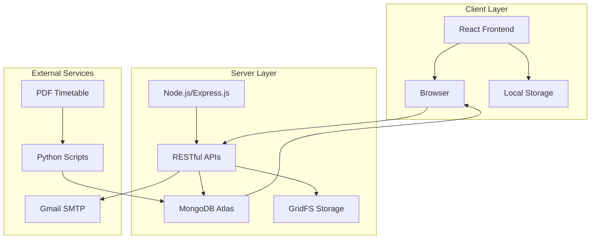
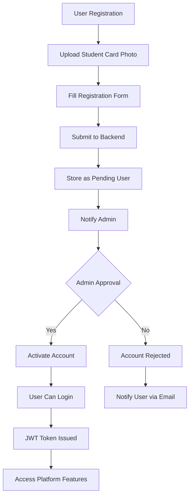

# System Architecture Diagram

```mermaid
graph TB
    subgraph "Client Layer"
        A[React Frontend] --> B[Browser]
        A --> C[Local Storage]
    end
    
    subgraph "Server Layer"
        D[Node.js/Express.js]
        E[RESTful APIs]
        F[MongoDB Atlas]
        G[GridFS Storage]
        
        D --> E
        E --> F
        E --> G
    end
    
    subgraph "External Services"
        H[Gmail SMTP]
        I[PDF Timetable]
        J[Python Scripts]
    end
    
    B --> E
    F --> B
    E --> H
    I --> J
    J --> F
```
# User Registration & Authentication Flow

```mermaid
flowchart TD
    Start[User Registration] --> Upload[Upload Student Card Photo]
    Upload --> Form[Fill Registration Form]
    Form --> Submit[Submit to Backend]
    Submit --> Store[Store as Pending User]
    Store --> Notify[Notify Admin]
    Notify --> Approve{Admin Approval}
    Approve -->|Yes| Activate[Activate Account]
    Activate --> Login[User Can Login]
    Approve -->|No| Reject[Account Rejected]
    Reject --> NotifyUser[Notify User via Email]
    
    Login --> Auth[JWT Token Issued]
    Auth --> Access[Access Platform Features]
```

