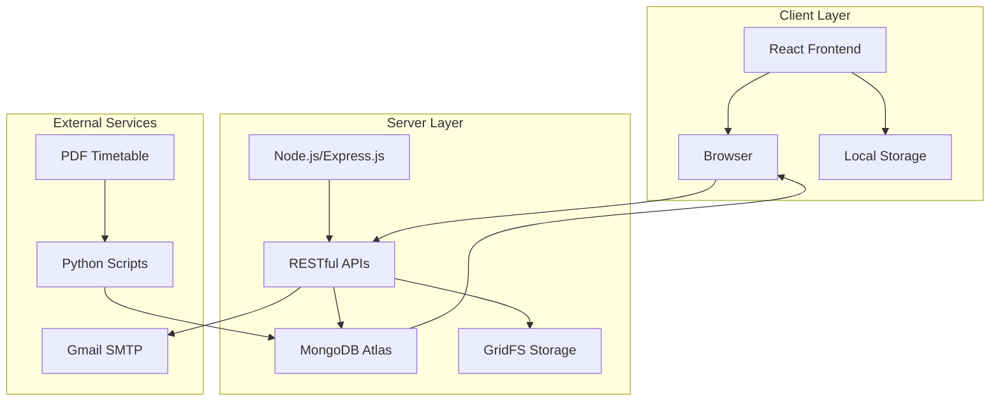
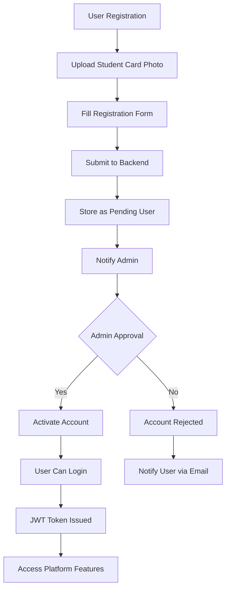
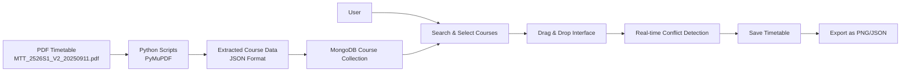
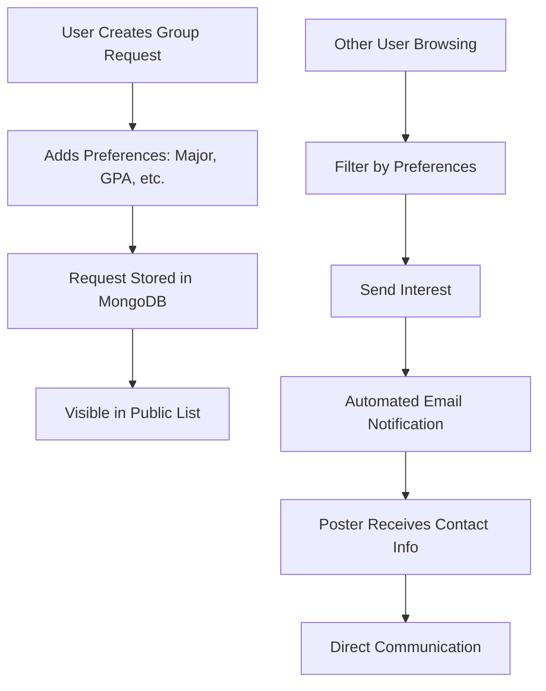
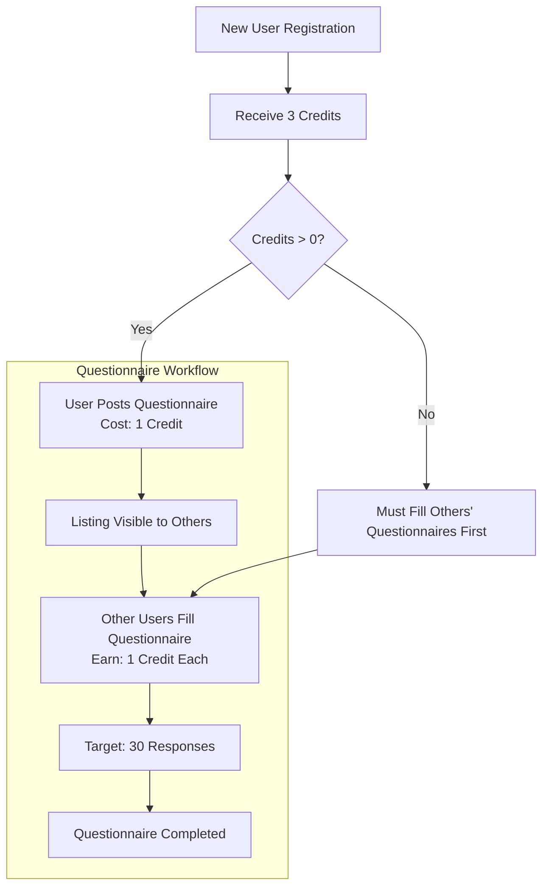
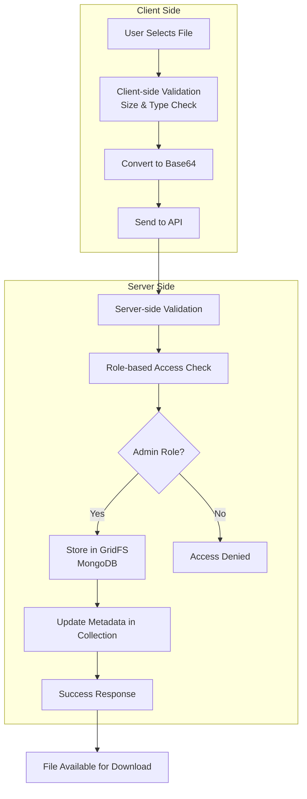
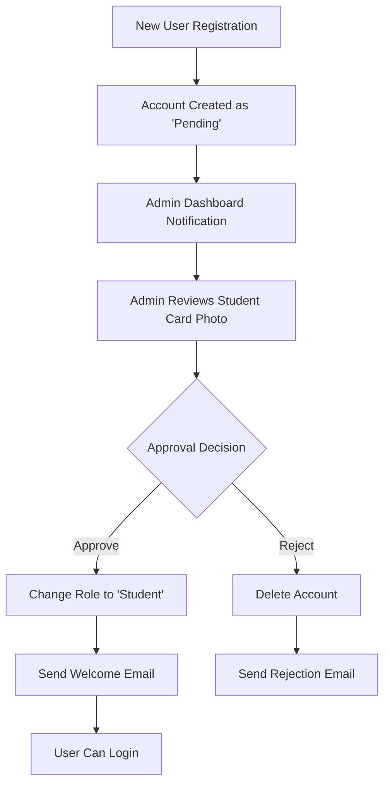
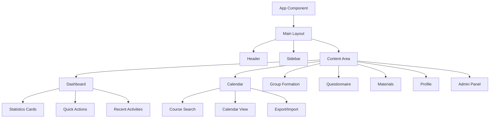
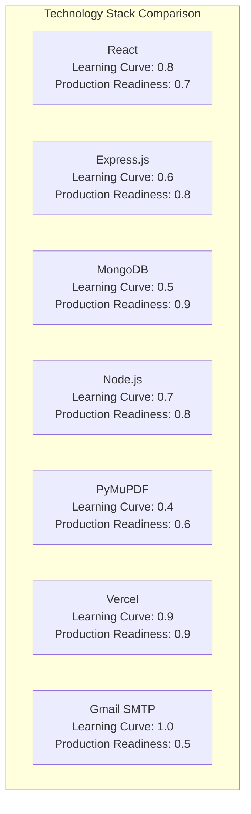
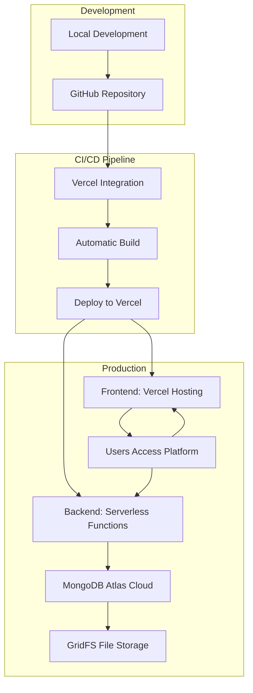

# System Architecture Diagram

# User Registration & Authentication Flow

# Timetable Planner Workflow

# Group Formation System

# Questionnaire Credit System

# File Upload & Storage Flow

# Admin Approval Workflow

# Component Hierarchy

# Technology Stack Visualization

# Deployment Architecture

