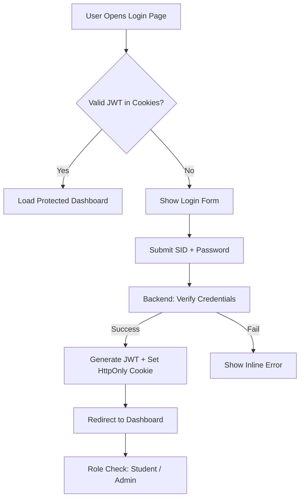
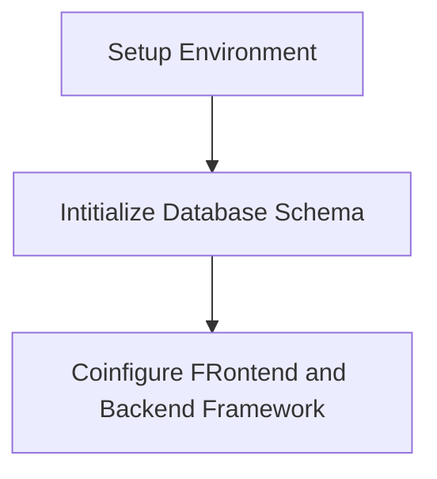
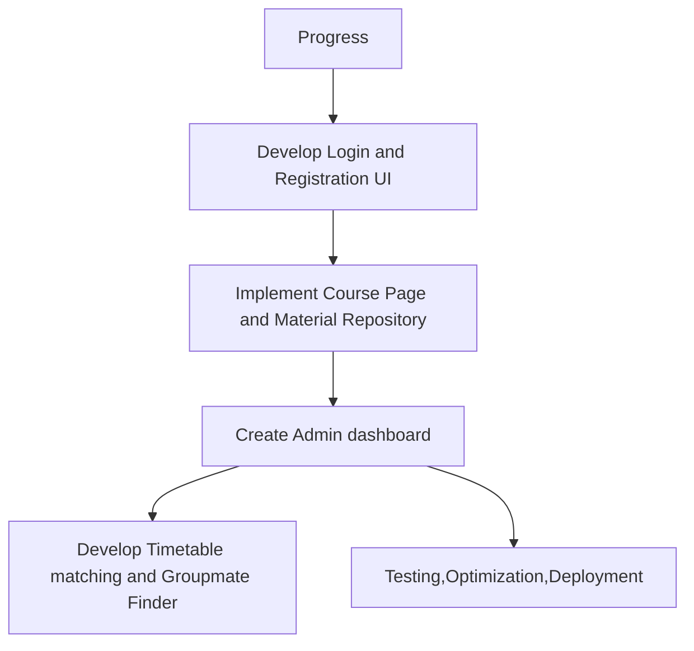

## 1. Authentication & Access Control

```mermaid
flowchart TD
    A[User Opens Login Page] --> B{Valid JWT in Cookies?}
    B -- Yes --> C[Load Protected Dashboard]
    B -- No --> D[Show Login Form]
    D --> E[Submit SID + Password]
    E --> F[Backend: Verify Credentials]
    F -- Success --> G[Generate JWT + Set HttpOnly Cookie]
    F -- Fail --> H[Show Inline Error]
    G --> I[Redirect to Dashboard]
    I --> J[Role Check: Student / Admin]
```

```mermaid
flowchart TD
    A[Setup Environment]-->B[Intitialize Database Schema]
    B-->C[Coinfigure FRontend and Backend Framework]
```

```mermaid
flowchart TD
    Progress[Progress]-->Dev[Develop Login and Registration UI]
    Dev-->course[Implement Course Page and Material Repository]
    course-->dashb[Create Admin dashboard]
    dashb-->timetable[Develop Timetable matching and Groupmate Finder]
    dashb-->finish[Testing,Optimization,Deployment]
```